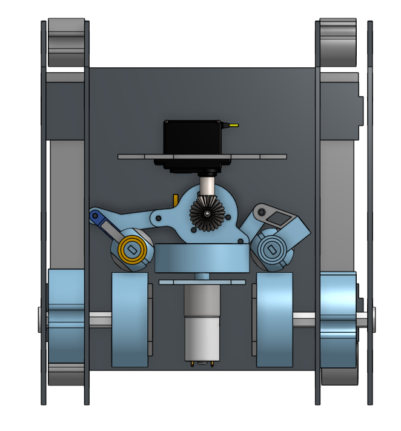

# Michael Farah Portfolio

## About Me

## Resume

## Projects

#### 3DOF robot using 2 dc motors

The above robot was designed to be able to move with three domains of freedom despite being restricted to only having 2 dc motors. To achieve this a transmission actuated by a servo motor changes the direction the treads will turn in relation to the forward drive motor. The second dc motor connects to an omni-wheel, allowing for horizontal translation.

The transmission relies on two spheres to transfer the rotary motion to the treads, as the plastic parts of the robot had to be 3D printed, the spheres were designed to not need support material.

#### Gerotor Hydraulic Pump

#### Non-Atmosphere Cooling system

#### Linear Induction Motor Test Stand
