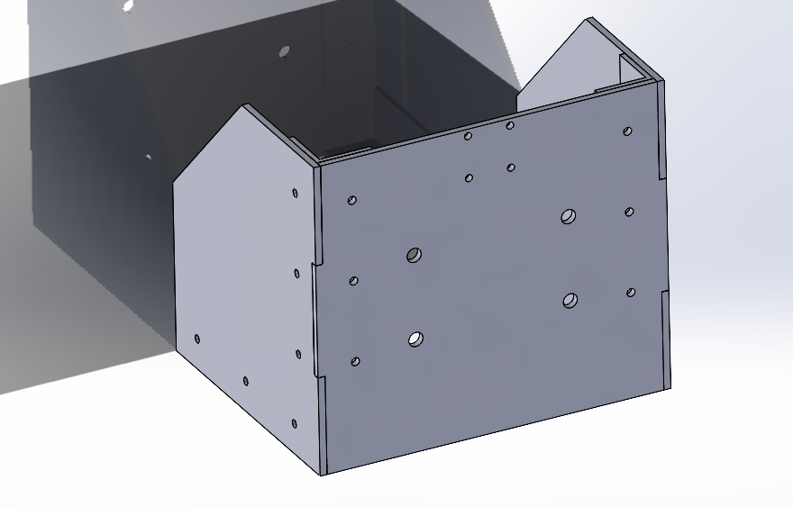

# Michael Farah Portfolio

## About Me

## Resume

## Projects

#### 3DOF robot using 2 dc motors

The above robot was designed to be able to move with three domains of freedom despite being restricted to only having 2 dc motors. To achieve this a transmission actuated by a servo motor changes the direction the treads will turn in relation to the forward drive motor. The second dc motor connects to an omni-wheel, allowing for horizontal translation.

The transmission relies on two spheres to transfer the rotary motion to the treads, as the plastic parts of the robot had to be 3D printed, the spheres were designed to not need support material.

#### Gerotor Hydraulic Pump

This is a gerotor hydraulic pump. The pump was designed to take advantage of Solidworks global variable feature. The size of the chambers, driven gear teeth, and the radius of the overall pump can all be adjusted from the equations tab to finely adjust the flow rate of the pump.

#### Linear Induction Motor Test Stand

This test stand was designed for Queen’s Hyperloop Design Team to test the capabilities of the Linear Induction Motor. Using Solidworks, simulations were run to ensure the stand would be able to support the 60 pound weight of the Linear Induction Motor. The tests included shear out failure for the bolt holes and buckling for the face and side plates.
